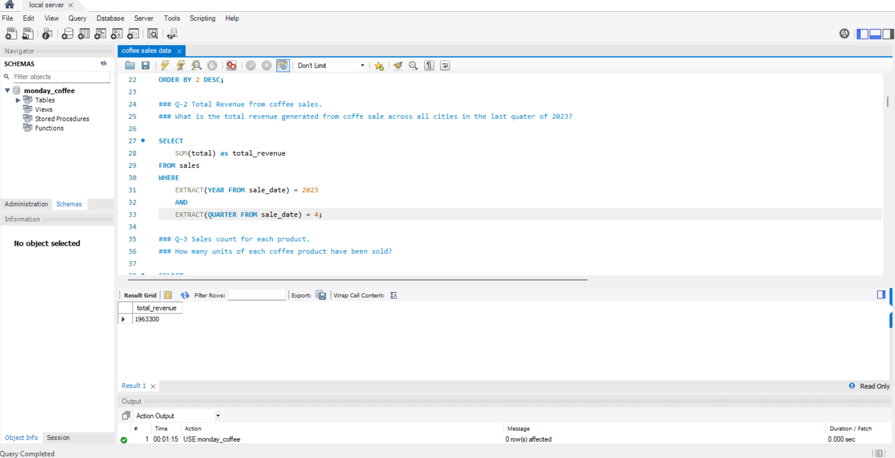

☕ Coffee Sales SQL Analysis
📌 Project Overview

This project analyzes coffee sales data to uncover customer behavior, sales trends, and city-level market opportunities using SQL.

🎯 Business Problem

A coffee company wants to understand:

Which cities generate the most revenue

Customer purchasing behavior

Product performance

Market expansion opportunities

🛠 Tools Used

SQL (MySQL)

Joins

CTEs

Window Functions

📊 Key Business Questions

How many people in each city consume coffee?

What is the total revenue in Q4 2023?

Which products are sold the most?

What is the average sales per customer in each city?

Which cities have the highest market potential?

What are the top-selling products by city?

What is the monthly sales growth trend?

📈 Key Insights

High-revenue cities show strong multi-product purchasing behavior

Some cities have high population but low customer conversion

Certain products consistently dominate across all cities

Monthly trends show seasonal growth patterns

💡 Business Recommendations

Focus expansion in high-revenue & low-rent cities

Target high-population cities with marketing campaigns

Promote top-performing products across regions

Use customer behavior data for cross-selling strategies

📂 Project Files

coffee sales data.sql → Contains all SQL queries and analysis

## 📷 SQL Query Outputs  

### 💰 Total Revenue (Q4 2023)

---

### 🏆 Top Selling Products

---

### 🌍 Average Sales per City

